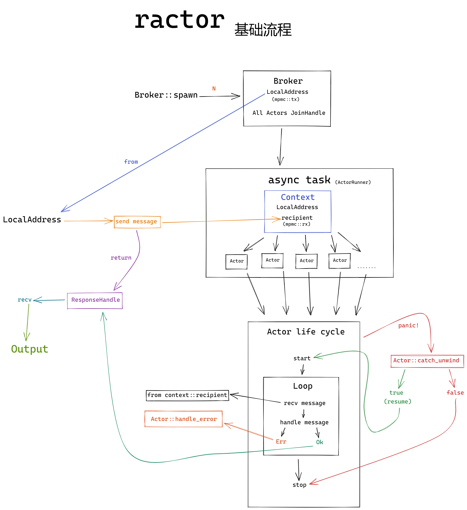
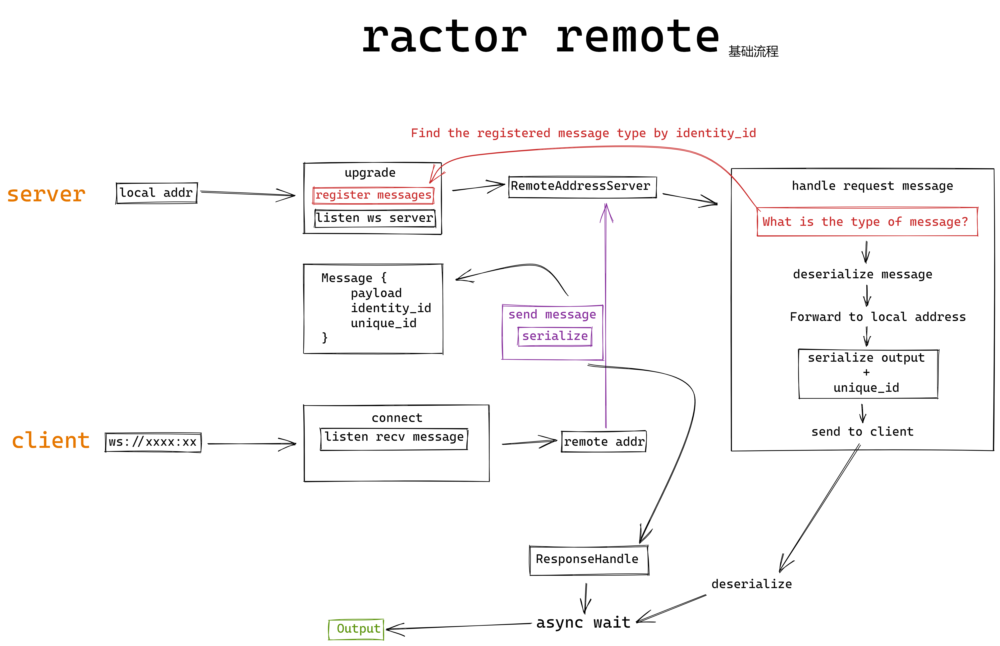

# ractor

> An actor model framework. Personal projects for research and learning.
> 
> 一个actor模型框架. 用于我个人学习与研究.

## TODO
- [ ] 文档和注释
- [x] 实现分布式, 使用远程地址给actor发送消息.(就像akka)(基本完成)
- [ ] 提供更方便的过程宏, 简化定义`actor`和`message handler`的过程.
- [ ] 使用hyper和tower实现一个基于ractor的http框架.(就像actix-web).
- [x] 错误处理和恢复, 出现错误时优雅的停止或重置actor(基本完成).
- [ ] 实现`父` `子`结构.(就像akka)
- [ ] 消息发送错误时转发到其他Actor
- [ ] 动态增减Actor  
- [ ] 更多...如果你也感兴趣

---
> 非科班学生, 业余爱好者, 基础差, 如有实现错误欢迎指出.
> 
> 参考: [pony](https://www.ponylang.io/), [akka](https://akka.io/)

## 基础流程

## Remote 基础流程

