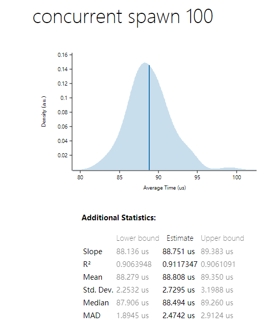

# ractor

> An actor model framework. Personal projects for research and learning.
> 
> 一个actor模型框架. 用于我个人学习与研究.

## Feature
- [x] 基于异步
- [x] 使用tokio多线程runtime可以充分利用多线程运行actor
- [x] 使用生命周期状态, 可以比较方便编写流程
- [x] actor的开销不大, 创建百万个actor只需要1.7Gb内存

## TODO
- [ ] 更详细的文档和注释
- [x] 实现分布式, 使用远程地址给actor发送消息.(完成一个简陋的有基础功能的demo)
- [ ] 提供更方便的过程宏, 简化定义`actor`和`message handler`的过程.
- [ ] 使用hyper和tower实现一个基于ractor的http框架.(就像actix-web).
- [ ] 实现`父` `子`结构.(就像akka)
- [ ] 消息发送错误时转发到其他Actor
- [ ] 动态增减Actor  
- [ ] 更多...如果你也感兴趣

---
> 非科班学生, 业余爱好者, 基础差, 如有实现错误欢迎指出.
> 
> 参考: [pony](https://www.ponylang.io/), [akka](https://akka.io/)

## Benchmark
### 生成一个actor

## 基础流程

## Remote 基础流程

